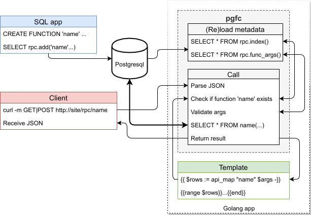

  English |
  <a href="docs/ru/README.md#pgfc">Pусский</a>

---

# pgfc
> golang package for postgresql functions calling

[![GoCard][gc1]][gc2]
 [![GitHub Release][gr1]][gr2]
 [![GitHub code size in bytes][sz]]()
 [![GitHub license][gl1]][gl2]

[gc1]: https://goreportcard.com/badge/apisite/pgfc
[gc2]: https://goreportcard.com/report/github.com/apisite/pgfc
[gr1]: https://img.shields.io/github/release/apisite/pgfc/all.svg
[gr2]: https://github.com/apisite/pgfc/releases
[sz]: https://img.shields.io/github/languages/code-size/apisite/pgfc.svg
[gl1]: https://img.shields.io/github/license/apisite/pgfc.svg
[gl2]: LICENSE

**Project status:** PoC is ready

## License

The MIT License (MIT), see [LICENSE](LICENSE).

Copyright (c) 2018 Aleksei Kovrizhkin <lekovr+apisite@gmail.com>
